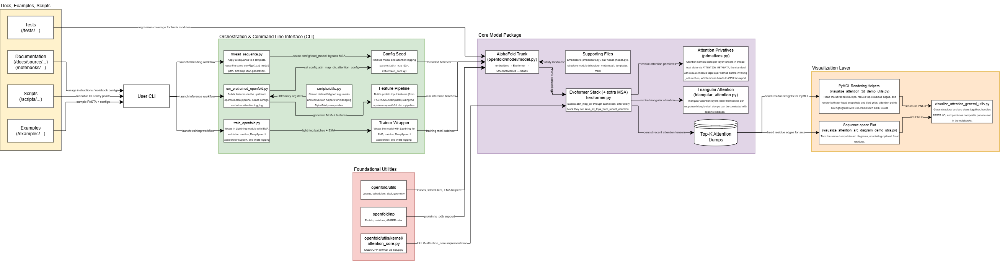
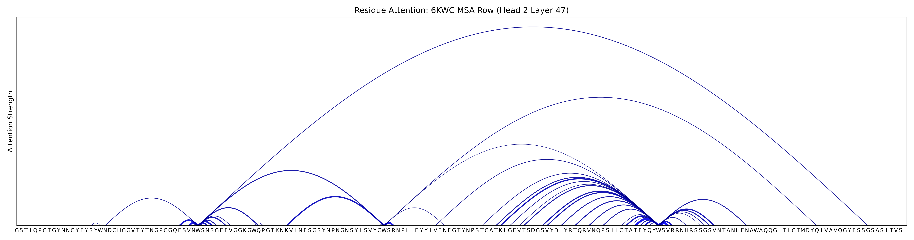
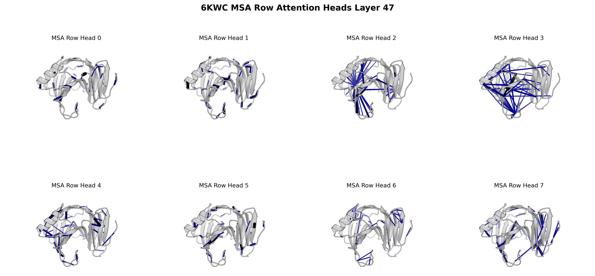
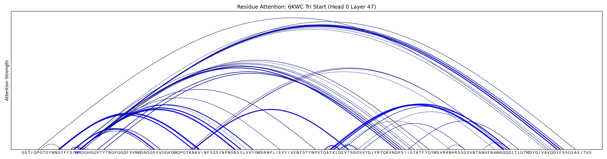
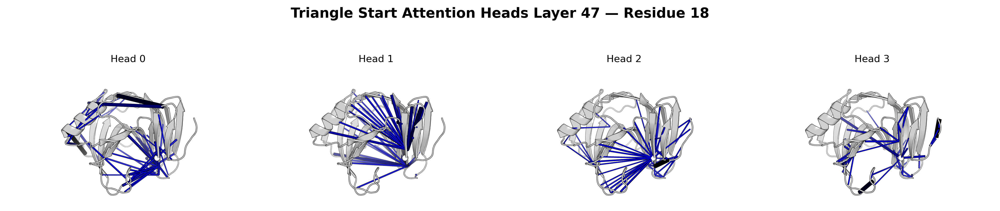

# Vizfold Foundations

Vizfold is a platform for running protein-structure models and inspecting what they compute:

1. Model inference & feature extraction: Run protein structure prediction models and extract intermediate activations (hidden representations) and attention maps from any chosen layer.
2. Visualization & analysis: Explore, visualize, and analyze the extracted activations and attention maps.

The `vizfold` CLI is the platform; a model backend plugs in underneath it. Install one with
`vizfold install <backend>` — **OpenFold** (the full cluster install: micromamba env, CUDA
extension build, AlphaFold2 databases) or **ESMFold** (a lightweight venv with PyTorch +
Transformers, weights pulled from HuggingFace at run time). `vizfold status` shows the resolved
config and which backends are installed. Each backend is a pip/conda-installable package under
`backends/<name>/` with its own environment and installer, so others (openfold3, boltz) slot in
the same way as they land.

---

## Install

Two steps on a cluster. First bootstrap the `vizfold` CLI — one command, needs nothing from you:

```bash
curl -sL https://raw.githubusercontent.com/AI2Science/vizfold-foundation/main/install.sh | bash
```

That downloads the prebuilt `vizfold` binary for your architecture from the latest GitHub
release and installs it to `~/.local/bin` (set `VIZFOLD_VERSION=vX.Y.Z` to pin a release). Then
install a backend — OpenFold below, or the lighter `vizfold install esmfold` (see
[docs/esmfold.md](docs/esmfold.md)):

```bash
vizfold install openfold
```

`vizfold install <backend>` clones the matching checkout to `$HOME/vizfold-src` on first run (the binary
ships only itself; the `install/` scripts and dashboard come from there), works out where it is
running, picks the site, submits the OpenFold install to the scheduler, and prints the exact
command to fold a test sequence. Cold: ~8 min on NCSA Delta, ~25 min where the AlphaFold
databases have to be downloaded.

`vizfold install openfold` holds your terminal and streams every step of the install as it happens. On a
cluster it runs as a blocking `srun` job, so a queue wait shows as
`srun: job N queued and waiting for resources`. Use `tmux` or `screen` for long installs — if the
connection drops, re-run `vizfold install openfold` and it continues from the last completed step.

To keep a log, wrap the whole command rather than piping it:

```bash
script -q -e -c 'vizfold install openfold' install.log
```

Do not pipe to `tee` — that replaces the terminal with a pipe, which suppresses download progress
meters and makes the output arrive in delayed bursts.

### Uninstall

```bash
vizfold uninstall
```

Lists everything the install generated — the conda environment (and any ESMFold venv) and the
rest of the install prefix, the package caches beside it, the symlinks and build droppings it left in the checkout,
the run database, the checkout it cloned into `$HOME/vizfold-src`, and
`~/.config/vizfold/vizfold.json` — then removes it once you confirm (`--yes` skips the prompt).
Fold outputs under the prefix, a checkout you pointed it at yourself, and the `vizfold` binary
are left alone; drop the binary with `rm ~/.local/bin/vizfold`.

### Supported clusters

Dispatch is on the SLURM `ClusterName`, so on these machines `vizfold install openfold` needs no
site arguments. Accounts and the install prefix are worked out live (your project space, the
accounts you can charge); the values below are what a fresh install settles on.

| `ClusterName` (cluster) | Verified | Arch | AF2 databases | Build → fold partition (GPU) | Install prefix |
| --- | --- | --- | --- | --- | --- |
| `delta` (NCSA Delta) | ✅ install + fold | x86-64 | mirror¹ | `cpu` → `gpuA100x4-interactive` (A100) | `/work/nvme/<alloc>/<user>/vizfold` |
| `delta-gh` (NCSA Delta-AI) | ✅ install + fold³ | aarch64 (GH200) | mirror¹ | `ghx4` → `ghx4-interactive` (GH200) | `/work/nvme/<alloc>/<user>/vizfold-gh`² |
| `nexus-dev` (Nexus) | ◐ install⁵ | x86-64 | downloaded | `gpu` → `gpu` (A100 10 GB vGPU)⁴ | `/projects/<user>/vizfold` |
| `anvil` (Purdue Anvil) | ◐ install⁵ | x86-64 | downloaded | `shared` → `gpu` (A100) | `$PROJECT/<user>/vizfold` |
| `bridges2` (PSC Bridges-2) | ◐ install⁵ | x86-64 | mirror¹ | `RM-shared` → `GPU-shared` (V100-32) | `/ocean/projects/<acct>/<user>/vizfold` |
| `expanse` (SDSC Expanse) | ⚙️ profile | x86-64 | downloaded | `shared` → `gpu-shared` (V100) | `/expanse/lustre/projects/<acct>/<user>/vizfold` |
| `ice-slurm` (GT PACE ICE) | ⚙️ profile | x86-64 | mirror¹ | `ice-cpu` → `ice-gpu` (A100) | `<scratch>/vizfold` (`/storage/ice1/…`) |
| `phoenix-slurm` (GT PACE Phoenix) | ⚙️ profile | x86-64 | mirror¹ | `cpu-small` → `gpu-a100` (A100) | `<scratch>/vizfold` (`/storage/scratch1/…`) |

Legend — ✅ install + fold verified end-to-end from `vizfold install` (fold → 2839-atom relaxed
structure); ◐ install run on the cluster with its site-specific fixes, final fold not re-confirmed
in this pass⁵; ⚙️ site profile written and its paths probed live, full install not yet run.

1. AF2 mirrors: Delta & Delta-AI (shared `/work/hdd`) `/work/hdd/data/alphafold2/database`,
   Phoenix `/storage/coda1/ice1/shared/d-pace_community/alphafold/alphafold_2.3.2_data`, ICE
   `/storage/ice1/shared/d-pace_community/…`, Bridges-2 `/ocean/datasets/community/alphafold/v2.3.2`.
   Each mirror lays out `uniclust30` differently (real single- or double-nested set, or none), so
   the install stages it into a canonical dir — real set if present, else aliased from uniref30.
   Where there is no mirror the install downloads the ~4 GB parameters + the example's templates.
2. Delta and Delta-AI share `/work/nvme`, so the aarch64 site uses an `-gh` suffix — otherwise the
   two architectures' environments would clobber each other.
3. The aarch64 conda OpenMM ships no CUDA platform, so relaxation falls back to CPU (~15 s for the
   example) and yields the same structure as the x86 CUDA path.
4. Nexus's 535 driver is older than the env's NVRTC, so the install pins a matching NVRTC via
   `LD_PRELOAD`; the 10 GB vGPU gets the smaller `1UBQ_1` example. CUDA is capped at 12.8 on every
   x86 site and 12.9 on aarch64 (the 13.x build won't compile OpenFold's extension).
5. `◐` detail — nexus: cold-start install completed this session, NVRTC-pinned relaxation confirmed
   in earlier runs; anvil: install reached the dataset stage (fixed a conda-libcurl mmCIF bug),
   A100 fold queue-bound; bridges2: build + fold ran through to relaxation (memory / gcc / CUDA-arch
   / NVRTC fixes applied).

### Settings

Three layers, highest first. Each only fills what the one above left unset, so you override
exactly what you care about and nothing else:

| | | |
| --- | --- | --- |
| 1 | inline environment | `OPENFOLD_PREFIX=/scratch/me/vizfold vizfold install openfold` |
| 2 | `~/.config/vizfold/vizfold.json` | written by the install; edit to make a choice stick |
| 3 | `backends/openfold/install/sites/<site>.json` | the site's defaults, in the repo — edit to change them for everyone |

A `<site>.json` carries every variable and templates paths off `$VAR` references, resolved
recursively (`$VAR` against the environment first, then other keys in the same file). The site's
`<site>.sh` discovers only the one login-specific atom the templates need — the allocation, the
SLURM account, or `OPENFOLD_BASE` (the install directory). `backends/openfold/install/sites/delta.json`:

```json
{
  "OPENFOLD_ACCOUNT": "$ALLOC-delta-cpu",
  "OPENFOLD_AF2_ROOT": "/work/hdd/data/alphafold2/database",
  "OPENFOLD_BASE": "/work/nvme/$ALLOC/$USER",
  "OPENFOLD_EXAMPLE": "6KWC_1",
  "OPENFOLD_GPU_ACCOUNT": "$ALLOC-delta-gpu",
  "OPENFOLD_GPU_PARTITION": "gpuA100x4-interactive",
  "OPENFOLD_GPU_RESOURCES": "--cpus-per-task=8 --mem=32G",
  "OPENFOLD_MAX_CUDA": "12.8",
  "OPENFOLD_PARTITION": "cpu",
  "OPENFOLD_PREFIX": "$OPENFOLD_BASE/vizfold"
}
```

Here `delta.sh` discovers just `$ALLOC` (the `/work/nvme` allocation, via `sacctmgr`); the
account, base, and prefix all template off it.

`backends/openfold/install/sites/nexus-dev.json` — no database mirror, so `OPENFOLD_AF2_ROOT` is absent and the
install fetches the parameters itself. Its GPU is a 10 GB vGPU, hence the smaller example and
memory:

```json
{
  "OPENFOLD_EXAMPLE": "1UBQ_1",
  "OPENFOLD_GPU_PARTITION": "gpu",
  "OPENFOLD_GPU_RESOURCES": "--cpus-per-task=8 --mem=24G",
  "OPENFOLD_MAX_CUDA": "12.8",
  "OPENFOLD_PARTITION": "gpu"
}
```

To override for one run, put the variable inline — it wins over both files:

```bash
OPENFOLD_EXAMPLE=1UBQ_1 OPENFOLD_PARTITION=cpuA100x4 vizfold install openfold
```

Only the login-specific atom is discovered at run time (the allocation, account, or install
base); the templates in the `.json` derive the rest. Every value it settles on — fully
expanded — is written to `~/.config/vizfold/vizfold.json`, so other tools can read where things
ended up instead of guessing.

### Adding a cluster

Two files in `backends/openfold/install/sites/`, named after the cluster's SLURM `ClusterName`: `<name>.sh` — a
single `slurm::discover` that exports the one login-specific atom — and `<name>.json`, which
declares everything else and templates paths/accounts off that atom (and `$USER`). `vizfold
init` (via `backends/openfold/install/install.sh`) dispatches on `ClusterName`, so nothing else needs to change.

---

## Development

The repository is laid out as:

- `cli/` — the Rust `vizfold` CLI and executor core (SeaORM entities, migrations, services, and seed). This is the primary active implementation path.
- `workbench/` — a Next.js dashboard that reads the executor's SQLite directly (read-only) and renders each run's outputs: an interactive 3D structure viewer for predicted PDBs plus the attention-map images.
- `backends/<name>/` — one pip/conda-installable package per model backend: its Python package, packaging metadata, environment spec, and env-provisioning installer (`install/`). `backends/openfold/` installs as `import openfold` (conda env, CUDA extension; its dataprep/training tooling is the installed `openfold.scripts` subpackage); `backends/esmfold/` as `import esmfold` (plain venv).
- `downloaders/<name>/` — data-download scripts. `downloaders/openfold/` holds the AlphaFold2 database/params fetchers (`vizfold download openfold`); ESMFold has none — it pulls weights from HuggingFace at run time.
- `scripts/<name>/` — execution entrypoints (`run_pretrained_*.py`, `fold.sh`, slurm). Each imports its backend **by module** from the installed env — no relative paths, no cross-backend dependencies.
- `lib/` — the backend-neutral shared install library (`config.sh`), owned by no backend.
- `docs/` — architecture notes and backlog. `examples/` — demo inputs, attention-viz utilities, and notebooks.

End users install the prebuilt release binary (see [Install](#install)); the steps below build from source.

### Prerequisites

- Rust toolchain (`cargo`, `rustc`)
- Node.js 22 LTS or later, and npm (for the workbench)

### CLI and executor

Build and run the `vizfold` CLI from `cli/` (it is the crate's `default-run`, so `cargo run` alone runs it):

```bash
cd cli
cargo run -- seed          # create/migrate the SQLite DB and seed default records
cargo run -- list models
```

`seed` is safe to repeat and existence-guarded: it ensures the local OpenFold and ESMFold
backends, their `local-*` targets, and matching invocation profiles exist. SeaORM migrations run
automatically on every connect.

To install just the CLI binary into `~/.cargo/bin`:

```bash
cargo install --path . --bin vizfold --force
vizfold --help
```

The seeded local profiles assume the checked-out repository layout, so build and run against the
checkout rather than treating this as a standalone install. For a full end-to-end OpenFold run,
see [DEMO.md](DEMO.md).

#### Database

The executor uses SQLite. `config::database_url()` resolves the file in order: `DATABASE_URL`,
then `VIZFOLD_DB` (env or install config), then `<OPENFOLD_PREFIX>/vizfold.db`, then
`$XDG_DATA_HOME/vizfold/vizfold.db` (`~/.local/share/vizfold/vizfold.db` by default). Parent
directories are created automatically. The migration history was collapsed into a single baseline
on 2026-07-23; an older executor database fails with an actionable error naming the file to
delete — remove it and let the executor recreate it (seeding repopulates the defaults).

### Workbench

```bash
cd workbench
npm install
npm run dev            # http://localhost:3000
```

The workbench reads the executor's SQLite read-only. `vizfold serve` sets `VIZFOLD_DB` and links
run outputs under `public/runs` so the 3D viewer and attention images can load them; running
`npm run dev` by hand falls back to `<OPENFOLD_PREFIX>/vizfold.db` and shows an empty list until a
run exists.

### Tests

```bash
cd cli
cargo test
```

These exercise the in-memory SQLite path, SeaORM migrations, and the core registration/run/artifact services.

See [CONTRIBUTING.md](CONTRIBUTING.md) for branching and contribution guidance.

---

## Attention visualization (OpenFold)

A lightweight extension of [OpenFold](https://github.com/aqlaboratory/openfold) for interactive
visualization of attention in protein structure prediction. It renders MSA-row and triangle
attention scores as **arc diagrams** (sequence space) and **3D PyMOL overlays** (structure space).
The code lives with the OpenFold backend under `backends/openfold/viz/`.

### Key features

- Compatible with OpenFold outputs (`.pdb`, attention text dumps)
- Layer- and head-specific visualizations
- Integrated residue highlighting
- Notebook-friendly and HPC-friendly workflow

### Architecture

AttentionViz layers three lightweight components on top of upstream OpenFold:

- **Workflow assets** (docs, scripts, notebooks) provide reproducible configs and runnable examples.
- **Instrumented CLIs** wrap OpenFold inference/training so attention tensors are siphoned off without modifying the scientific core.
- **Visualization helpers** read the exported metadata and generate PyMOL overlays plus sequence-space plots.



- [High-res PDF](./backends/openfold/docs/imgs/AttentionViz_Architecture.pdf) for zooming/printing
- [Editable SVG](./backends/openfold/docs/imgs/AttentionViz_Architecture.svg) when updating the diagram source

### Installation

Assumes OpenFold is installed (`vizfold install openfold`, or see
[OpenFold's install docs](https://openfold.readthedocs.io/en/latest/Installation.html)), or that
you are using CyberShuttle (see `cybershuttle.yml`). The visualization helpers also need `PyMOL`
(open-source is fine), `matplotlib`, `numpy`, `scipy`, `pandas`, and `biopython`. You can install
the full dependency set (OpenFold included) directly from `cybershuttle.yml`. Verify the
repo-specific dependencies with:

```python
import os
import numpy as np
import matplotlib.pyplot as plt
import csv
from pymol import cmd
from pymol.cgo import CYLINDER, SPHERE
```

### Interactive demo

`backends/openfold/viz/viz_attention_demo_base.ipynb` demonstrates the full pipeline: it runs
OpenFold inference with precomputed alignments, extracts top-k residue-residue attention scores per
layer and head, saves them to text files, and visualizes **MSA row attention** and **triangle
start attention** as arc diagrams and 3D PyMOL overlays. Line thickness encodes attention strength.
(On CyberShuttle, use `backends/openfold/viz/viz_attention_demo.ipynb` instead.)

**MSA row attention (layer 47, protein 6KWC)** — pairwise attention inferred from the MSA, across
all heads at a selected layer:




**Triangle start attention (layer 47, residue 18)** — attention from a single (highlighted) residue
to others, as part of triangle-based geometric reasoning:




### Acknowledgements

Based on [**OpenFold**](https://github.com/aqlaboratory/openfold), an open-source reimplementation
of AlphaFold, distributed under the [Apache License 2.0](https://www.apache.org/licenses/LICENSE-2.0).
This repository extends OpenFold with attention-map visualization tools (3D + arc diagrams), demo
scripts and configuration, and inference-pipeline modifications for simplified usage, and includes
source originally developed by the OpenFold contributors with all original rights and attributions
retained under the Apache 2.0 License.

---

## License

This project is licensed under the [Apache License 2.0](https://www.apache.org/licenses/LICENSE-2.0).  
See the [LICENSE](./LICENSE) file for details.

---
