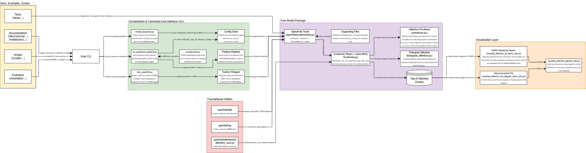
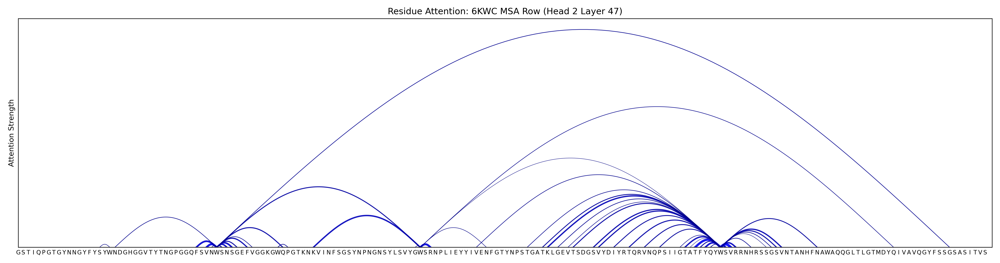
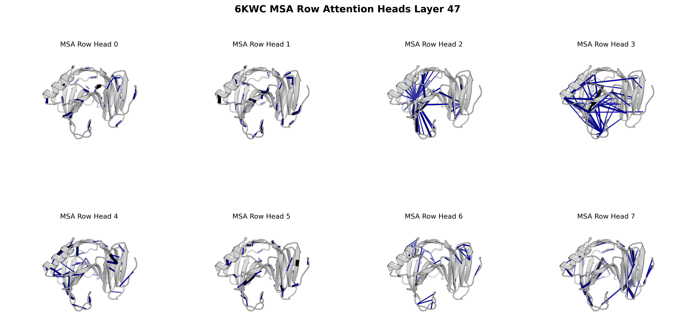
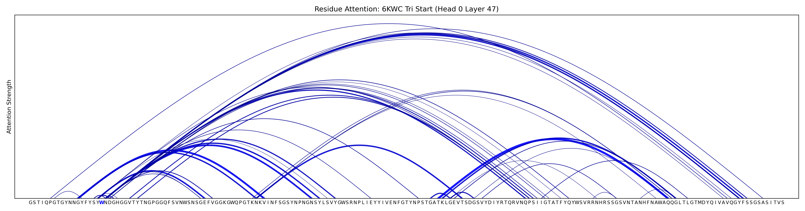
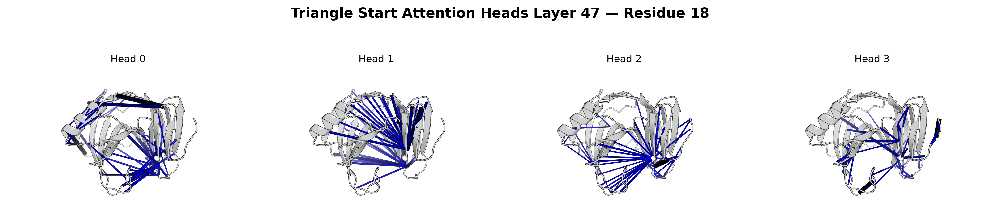

# Vizfold Foundations

Vizfold runs protein-structure models and keeps what they compute on the way: intermediate
activations and per-layer, per-head attention maps, ready to explore.

The `vizfold` CLI is the platform; a model backend — a pip/conda-installable package under
`backends/<name>/` with its own environment and installer — plugs in underneath. **OpenFold** is
the full cluster install (conda env, CUDA extension build, AlphaFold2 databases); **ESMFold**
is lighter, with its own Python, PyTorch and Transformers and weights pulled from HuggingFace at
run time.

---

## Install

Releases are Linux only, x86_64 or aarch64. Two steps on a cluster. First bootstrap the core
dependencies:

```bash
curl -fsSL https://raw.githubusercontent.com/AI2Science/vizfold-foundation/main/install.sh | bash
```

That fetches the prebuilt binary for your architecture from the latest GitHub release into
`~/.local/bin` (set `VIZFOLD_VERSION=vX.Y.Z` to pin a release), along with `micromamba` beside it:
every environment is created and run through it, and everything after this point assumes both are
on your `PATH`. It also enables tab completion, by adding a line to `~/.bashrc` and to `~/.zshrc`
where one exists; open a new shell to pick it up. Then the checkout everything else runs from, and a
backend — OpenFold below, or
`vizfold install esmfold` (see [docs/esmfold.md](docs/esmfold.md)):

```bash
vizfold install repo
vizfold install openfold
```

The binary ships only itself, so `install repo` clones the matching checkout to `$HOME/vizfold-repo`
for the installer scripts, the bundled proteins and the dashboard, and provisions the dashboard's
Bun runtime and dependencies so `serve` starts rather than installs. It then settles the site and
writes `~/.config/vizfold/vizfold.json` — which cluster, which prefix, which AlphaFold2 mirror holds
the protein databases, what the scheduler takes — so `status` reads `config ok` before any backend is
installed, and a backend install only has to build its environment. Nothing clones as a side effect:
every command that reads the checkout refuses until it is there, naming `vizfold install repo`. A cold backend install
takes ~8 minutes on a cluster with an AlphaFold2 mirror (measured on NCSA Delta), ~25 minutes on one
where the databases are downloaded instead — see the cluster table below for which is which.

It holds your terminal and streams every step. On a cluster it runs as a blocking `srun` job, so a
queue wait shows as `srun: job N queued and waiting for resources`. Use `tmux` or `screen` for long
installs — if the connection drops, re-run it and it continues from the last completed step.

To keep a log, wrap the whole command rather than piping it:

```bash
script -q -e -c 'vizfold install openfold' install.log
```

Do not pipe to `tee` — that replaces the terminal with a pipe, which suppresses download progress
meters and makes the output arrive in delayed bursts.

### Keeping it current

An install is two halves: the `vizfold` binary and the checkout it runs the installers and
dashboard from, pinned to the binary's own release tag.

```bash
vizfold self-update      # the binary only
vizfold update repo      # the checkout only, to this binary's tag
```

One command each, so run both to move a whole install. Between them the checkout is behind, which
`status` reports as a broken `repo` — "the scripts are v0.7.1, but this binary is v0.7.2" — and
which `serve` and `list proteins` refuse on, since both read the checkout.

`vizfold update repo --ref <tag-or-branch>` moves the checkout somewhere else; it refuses to touch a
checkout with uncommitted changes, and it requires a checkout — `vizfold install repo` makes one.

A moved checkout is scripts, not an installed environment: both backend installers skip work they
have already done, so re-running `install <backend>` over a stale environment is a no-op.

```bash
vizfold update openfold   # remove what the install planted, reinstall from the current checkout
```

It keeps the downloaded databases and parameters — those are data, not install state — and asks
before removing anything (`--yes` skips the prompt).

### Uninstall

Everything a backend plants is its environment plus one state dir under the prefix,
`<prefix>/<backend>/` — `cutlass`, the `nvrtc-<ver>` side prefixes, the `pkgs`/`pip`/`tmp` caches,
the `.done` sentinel, and by default `data/`. Removing one backend is that pair, plus the build
droppings its `pip install` left in the checkout:

```bash
vizfold uninstall openfold
```

The config, the run database, the checkout, the shared package cache and any other backend stay,
so `vizfold install openfold` puts it back where it was. `vizfold uninstall repo` is the checkout
alone, and only the one vizfold cloned itself.

```bash
vizfold uninstall
```

With no part named it takes every part and, on top, the workbench environment, the package
cache, `vizfold.db`, `~/.config/vizfold/vizfold.json`, the staged workbench, and the checkout
vizfold cloned into `$HOME/vizfold-repo`. It lists what it will remove and asks first (`--yes` skips
the prompt). Fold outputs, a checkout you pointed it at yourself with `OPENFOLD_HOME`, and the
bootstrapped binaries are left alone; drop those with `rm ~/.local/bin/vizfold ~/.local/bin/micromamba`.

### Supported clusters

Dispatch is on the SLURM `ClusterName`, so on these machines `vizfold install openfold` needs no
site arguments. Accounts and the install prefix are worked out live; the values below are what a
fresh install settles on.

| `ClusterName` (cluster) | Verified | Arch | AF2 databases | Build → fold partition (GPU) | Install prefix |
| --- | --- | --- | --- | --- | --- |
| `delta` (NCSA Delta) | ✅ install + fold | x86-64 | mirror¹ | `cpu` → `gpuA100x4-interactive` (A100) | `/work/nvme/<alloc>/<user>/vizfold` |
| `delta-gh` (NCSA Delta-AI) | ✅ install + fold³ | aarch64 (GH200) | mirror¹ | `ghx4` → `ghx4-interactive` (GH200) | `/work/nvme/<alloc>/<user>/vizfold-gh`² |
| `nexus-dev` (Nexus) | ◐ install⁵ | x86-64 | mirror¹ | `gpu` → `gpu` (A100 10 GB vGPU)⁴ | `/projects/<user>/vizfold` |
| `bridges2` (PSC Bridges-2) | ◐ install⁵ | x86-64 | mirror¹ | `RM-shared` → `GPU-shared` (V100-32) | `/ocean/projects/<acct>/<user>/vizfold` |
| `ice-slurm` (GT PACE ICE) | ⚙️ profile | x86-64 | mirror¹ | `ice-cpu` → `ice-gpu` (A100) | `<scratch>/vizfold` (`/storage/ice1/…`) |
| `phoenix-slurm` (GT PACE Phoenix) | ⚙️ profile | x86-64 | mirror¹ | `cpu-small` → `gpu-a100` (A100) | `<scratch>/vizfold` (`/storage/scratch1/…`) |

✅ verified end-to-end from `vizfold install`; ◐ installed on the cluster, final fold not
re-confirmed in this pass; ⚙️ site profile written and its paths probed live, no install run yet.

1. AF2 mirrors: Delta & Delta-AI (shared `/work/hdd`) `/work/hdd/data/alphafold2/database`, Phoenix
   `/storage/coda1/ice1/shared/d-pace_community/alphafold/alphafold_2.3.2_data`, ICE
   `/storage/ice1/shared/d-pace_community/…`, Bridges-2 `/ocean/datasets/community/alphafold/v2.3.2`,
   Nexus `/media/volume/data/alphafold2/database`. Each lays out `uniclust30` differently,
   so the install stages it into a canonical dir — real set if present, else aliased from uniref30.
   With no mirror the install downloads the ~4 GB parameters + the example's templates.
2. Delta and Delta-AI share `/work/nvme`, so the aarch64 site uses a `-gh` suffix — otherwise the
   two architectures' environments would clobber each other.
3. The aarch64 conda OpenMM ships no CUDA platform, so relaxation falls back to CPU (~15 s for the
   example) and yields the same structure as the x86 CUDA path.
4. Nexus's 535 driver is older than the env's NVRTC, so the install pins a matching NVRTC via
   `LD_PRELOAD`; the 10 GB vGPU gets the smaller `1UBQ_1` example. CUDA is capped at 12.8 on every
   x86 site and 12.9 on aarch64 (the 13.x build won't compile OpenFold's extension).
5. `◐` installs each needed a site-specific fix: nexus an NVRTC pin, bridges2 memory / gcc /
   CUDA-arch / NVRTC adjustments.

### Settings

Three layers, highest first. Each only fills what the one above left unset:

| | | |
| --- | --- | --- |
| 1 | inline environment | `OPENFOLD_PREFIX=/scratch/me/vizfold vizfold install openfold` |
| 2 | `~/.config/vizfold/vizfold.json` | written by the install; edit to make a choice stick |
| 3 | `sites/<site>.json` | the site's defaults, in the repo — edit to change them for everyone |

`vizfold status` leads with the health of every part that can break on its own — the binary against
the newest release, the checkout, the config, each backend, and the scheduler — and prints what
those layers settled on below it:

```text
VizFold status

COMPONENT   STATUS  DETAIL
----------  ------  ------
micromamba  ok      /u/you/.local/bin/micromamba
cli         ok      0.9.0 (latest)
repo        ok      /u/you/vizfold-repo at v0.9.0
config      ok      19 keys
openfold    BROKEN  /work/nvme/bbol/you/vizfold/envs/vizfold-openfold
esmfold     absent  not installed (/work/nvme/bbol/you/vizfold/envs/vizfold-esmfold)
scheduler   ok      cpu, gpuA100x4-interactive, bbol-delta-cpu, bbol-delta-gpu

Problems:
  openfold: AlphaFold2 parameters missing or a dangling link: …/params_model_1_ptm.npz
  -> vizfold install openfold

1 of 6 components need attention: openfold.
```

It checks that the config holds exactly the keys this binary reads, that every path it names is
there, that each installed backend's environment and inputs are intact, and that the scheduler
recognises the accounts and partitions. What it cannot check here — no scheduler on this host — is
`unverified`, and a backend nobody installed is `absent`; neither counts against the install.

Two paths worth knowing. Environments live at `$VIZFOLD_ENV_BASE/vizfold-<backend>`, defaulting to
`<prefix>/envs` (`vizfold::env` in `lib/config.sh`, mirrored by `env_dir()` in
`cli/src/core/config.rs`); an install predating the env base recorded absolute
`OPENFOLD_ENV_PREFIX`/`ESMFOLD_ENV_PREFIX` values, which still outrank it. OpenFold's data — search
databases, templates, and the AlphaFold2 weights at `params/params_<preset>.npz` — lands in
`$OPENFOLD_DATA_DIR`, defaulting to `<prefix>/openfold/data`.

A `<site>.json` carries only what the site does differently, and templates paths off `$VAR`
references resolved recursively against the environment first, then other keys in the same file.
The site's `<site>.sh` discovers the one login-specific atom the templates need — the allocation,
the SLURM account, or `OPENFOLD_BASE` (the install directory). `sites/delta.json`:

```json
{
  "OPENFOLD_AF2_ROOT": "/work/hdd/data/alphafold2/database",
  "OPENFOLD_BASE": "/work/nvme/$OPENFOLD_ALLOCATION/$USER",
  "OPENFOLD_GPU_PARTITION": "gpuA100x4-interactive",
  "OPENFOLD_GPU_TIME": "01:00:00",
  "OPENFOLD_PARTITION": "cpu"
}
```

Five keys, all of them things only Delta knows. `delta.sh` discovers `$OPENFOLD_ALLOCATION` with
`slurm::nvme_alloc -delta-cpu -delta-gpu`, which both picks the `/work/nvme` allocation and names
the two accounts from those suffixes. The install prefix defaults to `$OPENFOLD_BASE/vizfold`
(`slurm::default_prefix`); only `delta-gh.json` overrides it, because Grace-Hopper shares
`/work/nvme` with x86 Delta and the two must not share an env.

A mirror is all-or-nothing: with `OPENFOLD_AF2_ROOT` set the install stops fetching parameters and
templates, so the root must also carry `params/` and `pdb_mmcif/mmcif_files` alongside the search
databases, or the install fails its verify step.

To override for one run, put the variable inline — it wins over both files:

```bash
OPENFOLD_EXAMPLE=1UBQ_1 OPENFOLD_GPU_PARTITION=gpuA100x4 vizfold install openfold
```

Every value the install settles on — fully expanded — is written to
`~/.config/vizfold/vizfold.json`, a fixed 19-key schema (`CONFIG_KEYS` in `cli/src/core/config.rs`,
`VIZFOLD_CONFIG_KEYS` in `lib/config.sh`) identical on every cluster. A key the install did not
settle is written empty rather than left out, and empty means unset everywhere that reads it. A
name belongs in the schema when the install settles it *and* something later needs it;
`tests/vocabulary.sh` enforces that, and that nothing a `<site>.json` sets goes unconsumed.

### Adding a cluster

Two files in `sites/`, named after the cluster's SLURM `ClusterName`: `<name>.sh` — a single
`slurm::discover` that exports the one login-specific atom — and `<name>.json`, which declares what
differs from the defaults and templates paths off that atom (and `$USER`). `vizfold install
openfold` (via `backends/openfold/install/install.sh`) dispatches on the name `slurm::cluster`
returns — `SLURM_CLUSTER_NAME`, else `scontrol`, else `ClusterName` in `slurm.conf`, lower-cased —
so nothing else needs to change.

Write only what the cluster actually determines. `tests/site_config.sh` resolves every site end to
end and snapshots the result, so a key that changes nothing shows up as removable — and a key that
changes something shows up in the diff. Run it after editing any site file, and `-u` to accept an
intended change.

---

## Commands

Once a backend is installed, one command folds a sequence:

```bash
vizfold run 1UBQ_1              # a bundled example id
vizfold run ./my.fasta          # a sequence of your own
vizfold run ./my_fastas/        # every FASTA in a directory
vizfold run 1UBQ_1 6KWC_1       # several targets, one execution, model loaded once
vizfold run 42                  # a queued run, by id (never mixed with other targets)
```

`run` records the run, executes it, and registers its outputs. Several targets fold in one
execution and land in one run directory, keyed by FASTA tag: `<tag>_model_1_ptm_relaxed.pdb` and
`attention/<tag>/`. `--no-exec` records the run and stops, printing the id to hand back to `run`
later. `serve` opens the dashboard over the outputs. `vizfold <command> --help` details any one.

```bash
vizfold serve                     # every installed backend
vizfold serve esmfold             # one, refused if it is not installed
vizfold serve openfold esmfold    # both, with a model picker on the Fold card
```

The dashboard folds with, and lists runs from, the backends it was told to serve; runs from the
others stay in the database, out of sight.

```text
install             Install the checkout everything runs from (`repo`), or a model backend from it
download            Download a backend's data (OpenFold AlphaFold2 databases/params)
status              Show resolved config, which backends are installed, and whether it all checks out
uninstall           Remove one part, or everything the install generated
update              Move the checkout to this binary's release (`repo`), or reinstall a backend from it
self-update         Replace this binary with the latest release. Run `update repo` after, for the checkout
serve               Start the workbench dashboard, over the given backends (default: all installed)
list                List executor records
show                Show one executor record
run                 Fold targets in one execution: bundled examples, FASTAs, directories of FASTAs -- or a queued run by id
register-artifacts  Register known artifacts for a completed run
completions         Print this shell's tab-completion script. `install.sh` wires it into your shell rc
```

Completion covers subcommands, flags, and the values of a fixed set — `install <TAB>` offers `repo`,
`openfold`, `esmfold`. The bootstrap eval's the binary's own output rather than writing a script out,
so a `self-update` cannot leave a stale one behind. To wire it up by hand, or for a shell the
bootstrap does not touch:

```bash
eval "$(vizfold completions bash)"          # also: zsh, fish, elvish, powershell
```

`vizfold list proteins` shows what there is to fold. `ALIGNMENTS` is `Y` where an MSA is
precomputed and reused; `N` folds too, paying for the full search:

```text
ID      RESIDUES  ALIGNMENTS  DESCRIPTION
------  --------  ----------  -------------------------------------
1G1J_1  43        Y           NON-STRUCTURAL GLYCOPROTEIN NSP4
1UBQ_1  76        Y           UBIQUITIN
1STM_1  157       Y           SATELLITE PANICUM MOSAIC VIRUS
6KWC_1  191       Y
2OMF_1  340       Y           MATRIX PORIN OUTER MEMBRANE PROTEIN F
```

The dashboard drives the same path: pick one of these in **Fold a protein** and it records,
executes, and registers the run for you. Batches come from the CLI.

For a full end-to-end walkthrough on a cluster, see [DEMO.md](DEMO.md).

---

## Development

- `cli/` — the Rust `vizfold` CLI and executor core (SeaORM entities, migrations, services, seed).
- `workbench/` — a Bun dashboard (Bun.serve + React + Base UI) reading the executor's SQLite
  read-only: a 3D viewer for predicted structures, arc diagrams drawn in the browser from each run's
  own attention dump, and whatever activations the run stored.
- `backends/<name>/` — one package per backend: Python package, packaging metadata, environment
  spec, env-provisioning installer (`install/`). `openfold` installs as `import openfold` (conda
  env, CUDA extension); `esmfold` as `import esmfold` (own Python, no CUDA build).
- `downloaders/<name>/` — data-download scripts; `downloaders/openfold/` holds the AlphaFold2
  fetchers behind `vizfold download openfold`. ESMFold has none — HuggingFace at run time.
- `scripts/<name>/` — the model entrypoints the executor runs (`run_pretrained_*.py`), importing
  their backend by module from the installed env.
- `lib/` — backend-neutral install machinery (`config.sh`, `slurm.sh`, `interactive.sh`). `sites/` —
  one `<ClusterName>.sh`/`.json` pair per cluster. `tests/` — install-side test suites.
- `docs/` — architecture notes and backlog. `examples/` — inputs, attention-viz utilities, notebooks.

Each backend also installs its own CLI into its environment under its own name, invoked as
`micromamba run -p <env> <name> --help` — the same form for both, and independent of the
`vizfold` binary. Through vizfold, `run` fills the model's arguments from the config and records
the run.

End users install the prebuilt release binary (see [Install](#install)); the steps below build from
source.

### Prerequisites

- Rust toolchain (`cargo`, `rustc`)
- Bun 1.2 or later (for the workbench). `vizfold serve` downloads one beside the staged dashboard
  when the machine has none, so this is only for running it by hand.

### CLI and executor

Build and run the `vizfold` CLI from `cli/` (it is the crate's `default-run`, so `cargo run` alone
runs it):

```bash
cd cli
cargo run -- status        # works with no install; everything else needs one
cargo run -- list models
```

Every command except `install`, `uninstall`, `status`, `update`, `self-update` and `completions` is gated on a
config existing at `~/.config/vizfold/vizfold.json` (`VIZFOLD_CONFIG` selects a different file), and
exits telling you to install a backend first. There is no seed step: migrations run on every
connect, and the run path seeds the default backends, their `local-*` targets and matching
invocation profiles themselves, existence-guarded. Those local profiles assume the checked-out
repository layout, so build and run against the checkout.

To install only the CLI binary into `~/.cargo/bin`:

```bash
cargo install --path . --bin vizfold --force
```

#### Database

The executor uses SQLite. `config::database_url()` resolves the file in order: `VIZFOLD_DB` (env or
install config, and it takes a full `sqlite:` URL), then `<OPENFOLD_PREFIX>/vizfold.db`, then
`$XDG_DATA_HOME/vizfold/vizfold.db` (`~/.local/share/vizfold/vizfold.db` by default). Parent
directories are created automatically. The migration history was collapsed into a single baseline
on 2026-07-23; an older executor database fails with an actionable error naming the file to delete —
remove it and let the executor recreate it (seeding repopulates the defaults).

### Workbench

```bash
cd workbench
bun install
bun run dev            # http://localhost:3000
```

`vizfold serve` exports `VIZFOLD_BIN`/`VIZFOLD_DB`/`OPENFOLD_PREFIX`/`VIZFOLD_BACKENDS`; the server
reads each run's files out of the run directory itself, checked against it, so nothing is linked
into the checkout. The workbench reads `process.env` only, never the vizfold config, so `bun run
dev` by hand needs them passed in — see [workbench/README.md](workbench/README.md).

### Tests

```bash
cd cli
cargo test

cd ../workbench
bun test               # attention parsing and run-file resolution
bun run typecheck
```

These exercise the in-memory SQLite path, SeaORM migrations, and the core registration/run/artifact
services. See [CONTRIBUTING.md](CONTRIBUTING.md) for branching and contribution guidance.

---

## Attention visualization (OpenFold)

A lightweight extension of [OpenFold](https://github.com/aqlaboratory/openfold) for interactive
visualization of attention in protein structure prediction. It renders MSA-row and triangle
attention scores as **arc diagrams** (sequence space) and **3D PyMOL overlays** (structure space).
The code lives under `examples/`.



- [High-res PDF](./docs/openfold/imgs/AttentionViz_Architecture.pdf) for zooming/printing
- [Editable SVG](./docs/openfold/imgs/AttentionViz_Architecture.svg) when updating the diagram source

### Installation

Assumes OpenFold is installed (`vizfold install openfold`, or see
[OpenFold's install docs](https://openfold.readthedocs.io/en/latest/Installation.html)). The
visualization helpers also need `PyMOL` (open-source is fine), `matplotlib`, `numpy`, `scipy`,
`pandas` and `biopython`.

### Interactive demo

`examples/viz_attention_demo_base.ipynb` demonstrates the full pipeline: it runs OpenFold inference
with precomputed alignments, extracts top-k residue-residue attention scores per layer and head,
saves them to text files, and visualizes **MSA row attention** and **triangle start attention** as
arc diagrams and 3D PyMOL overlays. Line thickness encodes attention strength. (On CyberShuttle,
use `examples/viz_attention_demo.ipynb` instead.)

**MSA row attention (layer 47, protein 6KWC)** — pairwise attention inferred from the MSA, across
all heads at a selected layer:




**Triangle start attention (layer 47, residue 18)** — attention from a single (highlighted) residue
to others, as part of triangle-based geometric reasoning:




### Acknowledgements

Based on [**OpenFold**](https://github.com/aqlaboratory/openfold), an open-source reimplementation
of AlphaFold. This repository extends it with attention-map visualization tools, demo scripts and
configuration, and inference-pipeline modifications for simplified usage; original rights and
attributions are retained per [NOTICE](./NOTICE).

---

## License

Apache License 2.0 — see [LICENSE](./LICENSE).
