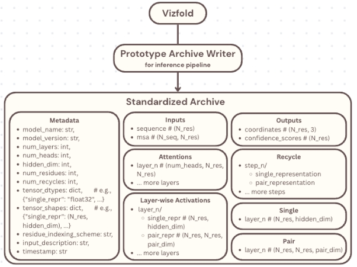

# Diagram

# Code description

This toolkit runs parameter sweeps for OpenFold, evaluates results, and stores the best runs in a structured Zarr archive for later analysis.

## Overview

It provides:

- Parameter sweep execution (grid or incremental)
- Scoring of model outputs
- Selection of best runs
- Archival of results, metadata, and artifacts

---

## Usage

```bash
python sweep.py \
  --base_command "python run_openfold.py --fasta_path input.fasta" \
  --grid_json params.json \
  --runs_root outputs/sweep_runs \
  --archive_path standardizedarchive/openfold_best_runs.zarr \
  --best_log_path standardizedarchive/best_entries.jsonl \
  --top_k 3 \
  --score_key plddt \
  --sweep_strategy incremental