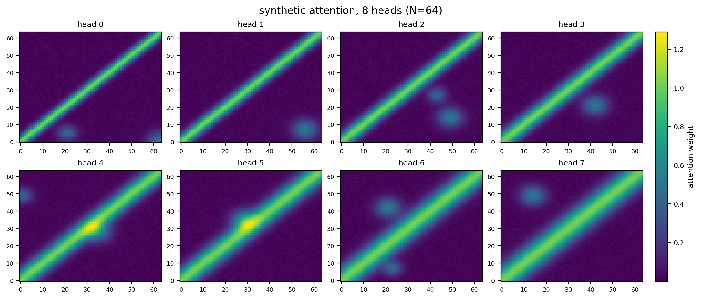
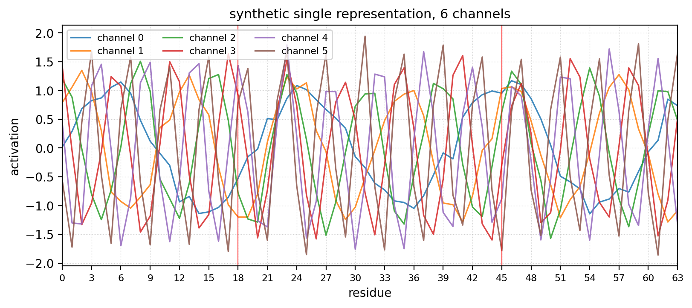
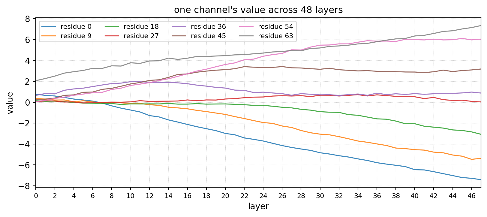
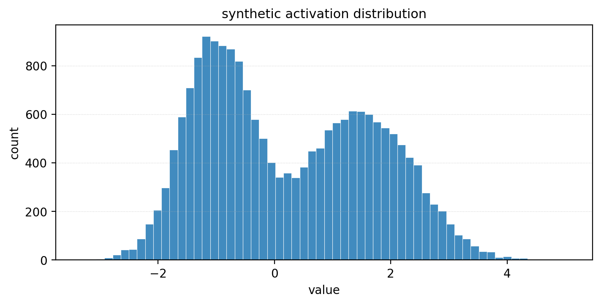
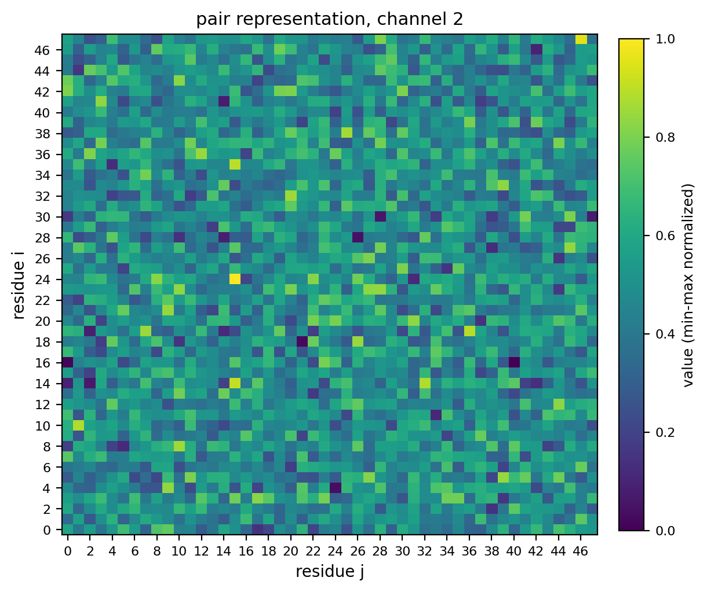
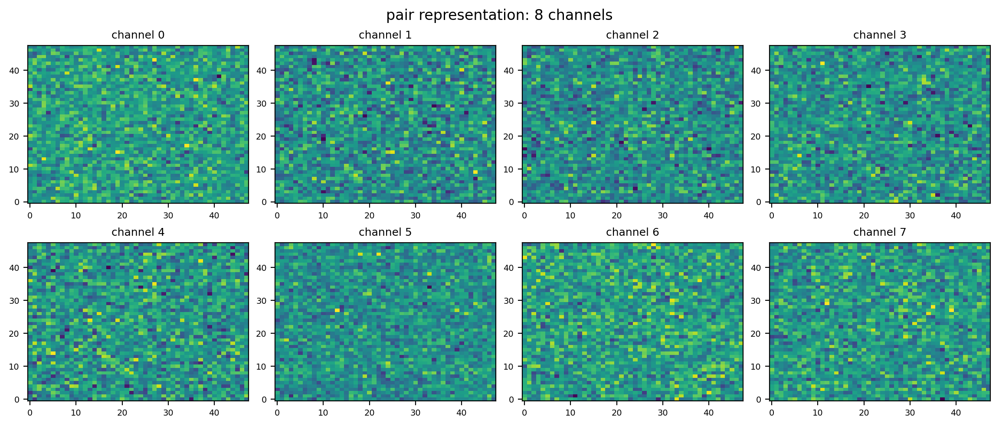
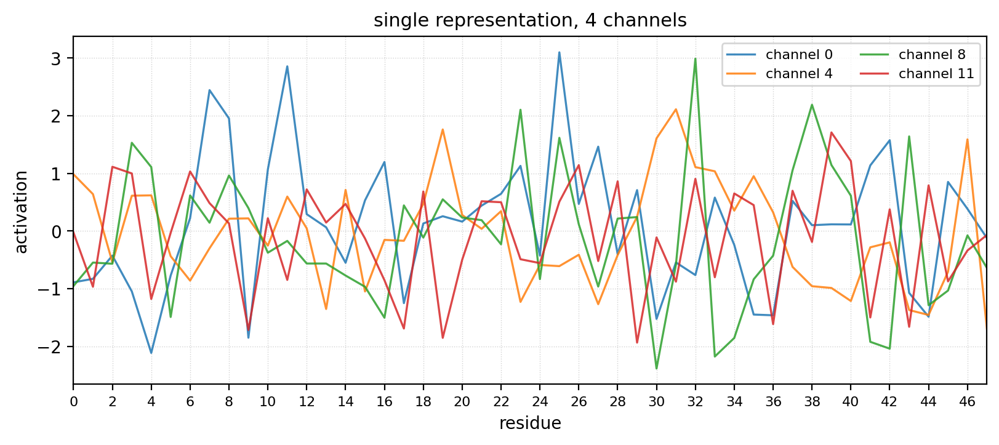

# `viz` — residue-indexed plot utilities

Generic plot functions for visualising OpenFold representations, scoped to
issue #8 deliverable: *"Provide functionalities for different types of
visualizations - including image and line plots."*

Every function takes plain numpy arrays in and returns a
`matplotlib.figure.Figure`, so the same code can be embedded in notebooks,
served by the Flask UI in [`web_interface.py`](../web_interface.py), or
composed with the existing `visualize_attention_*` helpers without changes.

## Public API

```python
from viz import (
    plot_heatmap,
    plot_heatmap_grid,
    plot_line,
    plot_lines,
    plot_layer_trajectory,
    plot_histogram,
)
```

| Function | Input shape | What it shows |
|---|---|---|
| `plot_heatmap` | `(R, C)` | one residue-by-residue map (attention slice, pair channel, MSA channel). |
| `plot_heatmap_grid` | `(K, R, C)` or list of `(R, C)` | K heatmaps in a grid (e.g. all heads of one layer). |
| `plot_line` | `(N,)` | a single residue-indexed signal (one channel of `s`, one row of an attention map, pLDDT, ...). |
| `plot_lines` | `(K, N)` or list of `(N,)` | K residue-indexed signals overlaid on one axis. |
| `plot_layer_trajectory` | `(L, N)` | one channel's value across `L` layers, drawing one line per chosen residue. |
| `plot_histogram` | any shape | distribution of values (flattened internally), useful for activation summaries. |

## Examples

### Heatmap

```python
import numpy as np
from viz import plot_heatmap

attn = np.random.rand(64, 64)
fig = plot_heatmap(
    attn,
    title="MSA-row attention, layer 47, head 2",
    colorbar_label="attention weight",
    highlight_residues=[18],
    save_path="outputs/heatmap_msa_row_layer47.png",
)
```


### Heatmap grid

```python
from viz import plot_heatmap_grid
from viz._fakes import fake_attention_heads

heads = fake_attention_heads(N=64, H=8)
plot_heatmap_grid(
    heads,
    titles=[f"head {i}" for i in range(8)],
    ncols=4,
    suptitle="MSA-row attention, layer 47",
    colorbar_label="attention weight",
    save_path="outputs/heatmap_grid_layer47.png",
)
```



### Line plot

```python
import numpy as np
from viz import plot_line

channel = np.random.randn(64)
fig = plot_line(
    channel,
    title="single representation, channel 12",
    ylabel="activation",
    highlight_residues=[18],
    save_path="outputs/lineplot_single_ch12.png",
)
```


### Multi-line overlay

```python
from viz import plot_lines
from viz._fakes import fake_single_channels

s = fake_single_channels(N=64, C=6)
plot_lines(
    s.T,
    labels=[f"channel {c}" for c in range(6)],
    title="single representation, 6 channels",
    save_path="outputs/lines_single.png",
)
```



### Layer trajectory

```python
from viz import plot_layer_trajectory
from viz._fakes import fake_layer_trajectory

traj = fake_layer_trajectory(L=48, N=64)
plot_layer_trajectory(
    traj,
    residue_indices=[0, 16, 32, 48],
    title="one channel across 48 layers",
    save_path="outputs/layer_trajectory.png",
)
```



### Histogram

```python
from viz import plot_histogram
from viz._fakes import fake_distribution

plot_histogram(
    fake_distribution(N=20000),
    bins=60,
    title="layer 47 activation distribution",
    save_path="outputs/hist_layer47.png",
)
```



## End-to-end: raw OpenFold tensors → figure

Once the model is producing real `pair`, `msa`, and `single` representations,
the cleanest path is to call the bridge helpers in
[`viz/integrations.py`](integrations.py). They wrap Priyavi's
[`representation_tensor_utils`](../representation_tensor_utils.py) so the
same call site works for any representation kind:

```python
from viz import (
    heatmap_from_representation,
    line_from_representation,
    lines_from_representation,
    pair_channel_grid,
)

# pair: shape (..., N, N, C_z)  -> residue × residue heatmap of one channel
heatmap_from_representation(
    z, kind="pair", channel=12,
    save_path="outputs/pair_ch12.png",
)

# single: shape (N, C_s)        -> per-residue line for one channel
line_from_representation(
    s, kind="single", channel=4, ylabel="activation",
)

# single: shape (N, C_s)        -> overlay several channels
lines_from_representation(
    s, kind="single", channels=[0, 4, 8, 11],
    save_path="outputs/single_overlay.png",
)

# pair: render the first 8 channels in a 4-column grid
pair_channel_grid(
    z, channels=list(range(8)), ncols=4,
    suptitle="pair representation: 8 channels",
    save_path="outputs/pair_grid.png",
)
```

Behavior delegated to `representation_tensor_utils`:

- Validation / shape checks (`pair` is square, leading batch dims squeezed).
- Channel selection vs. `mean`/`max`/`l2` aggregation across the channel axis.
- `minmax` / `zscore` / `none` normalization for display.
- For `kind="msa"` line plots: depth-averaged per residue.
- For `kind="pair"` line plots: diagonal slice at the chosen channel.

| Bridge function | Calls upstream | Then plots with |
|---|---|---|
| `heatmap_from_representation` | `prepare_heatmap_data` | `plot_heatmap` |
| `line_from_representation` | `prepare_lineplot_data` | `plot_line` |
| `lines_from_representation` | `prepare_lineplot_data` (per channel) | `plot_lines` |
| `pair_channel_grid` | `prepare_heatmap_data` (per channel) | `plot_heatmap_grid` |





## Conventions

- All functions return a `Figure` and never call `plt.show()`.
- Pass `save_path=...` to persist a PNG (parent dirs created on demand).
- Axes default to residue indexing (`residue i`, `residue j`, `residue`).
- Wrong-rank inputs raise `ValueError` early.

## Synthetic tensors (`viz._fakes`)

While the model-side extraction layer is still in progress,
[`viz/_fakes.py`](_fakes.py) provides shape-matching synthetic tensors so the
plot functions (and the `*_from_representation` bridge above) can be
exercised end-to-end. Once real `m` / `z` / `s` tensors arrive from the
extraction step, the bridge functions consume them directly through
`representation_tensor_utils` -- no code change here.

| Helper | Shape | Stand-in for |
|---|---|---|
| `fake_attention_heads(N, H)` | `(H, N, N)` | per-head attention map |
| `fake_pair_channel(N)` | `(N, N)` | one channel of the pair representation `z` |
| `fake_single_channels(N, C)` | `(N, C)` | multi-channel single representation `s` |
| `fake_layer_trajectory(L, N)` | `(L, N)` | one channel across layers |
| `fake_distribution(N)` | `(N,)` | flat values for histograms |

## Demo

[`notebooks/viz_plot_demo.ipynb`](../notebooks/viz_plot_demo.ipynb) exercises
every plot function and writes the example PNGs above.
