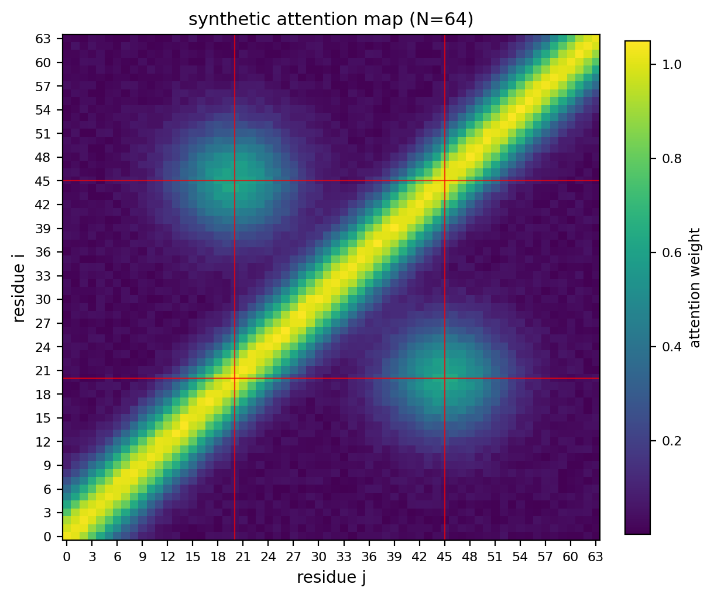
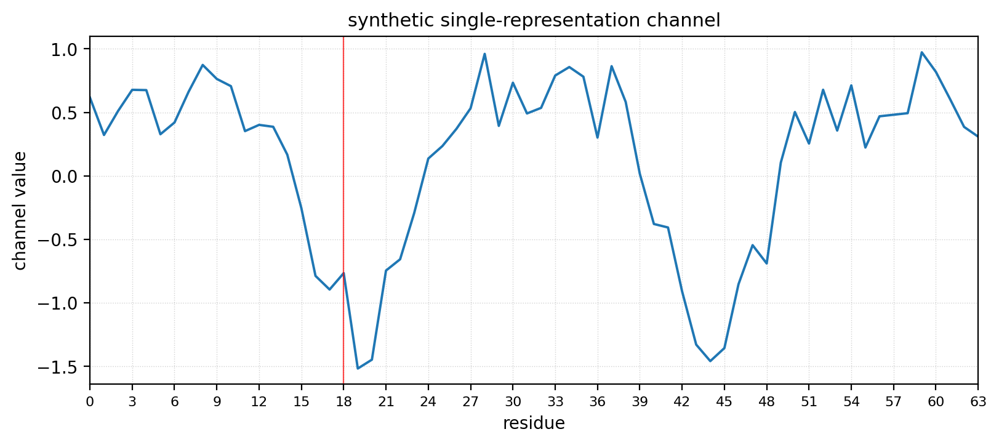

# `viz` — residue-indexed plot utilities

Generic plot functions for visualising OpenFold representations, scoped to
issue #8 deliverable: *"Provide functionalities for different types of
visualizations - including image and line plots."*

Both functions take plain numpy arrays in and return a `matplotlib.figure.Figure`,
so they can be embedded in notebooks, served by the Flask UI in
[`web_interface.py`](../web_interface.py), or composed with the existing
`visualize_attention_*` helpers without changes.

## Public API

```python
from viz import plot_heatmap, plot_line
```

### `plot_heatmap(matrix, *, title=None, xlabel="residue j", ylabel="residue i", cmap="viridis", vmin=None, vmax=None, colorbar_label=None, highlight_residues=None, save_path=None) -> Figure`

2-D image plot. Use for attention maps `(N, N)`, pair-representation channels
`z[:, :, c]`, or rectangular tensors like an MSA channel `(S, N)`.

### `plot_line(values, *, x=None, title=None, xlabel="residue", ylabel="value", color="tab:blue", highlight_residues=None, save_path=None) -> Figure`

1-D line plot over residue index. Use for single-representation channels
`s[:, c]`, single rows of an attention matrix, or per-residue scalars
(pLDDT, attention entropy, etc.).

## Examples

### Heatmap

```python
import numpy as np
from viz import plot_heatmap

attn = np.random.rand(64, 64)
fig = plot_heatmap(
    attn,
    title="MSA-row attention, layer 47, head 2",
    colorbar_label="attention weight",
    highlight_residues=[18],
    save_path="outputs/heatmap_msa_row_layer47.png",
)
```



### Line plot

```python
import numpy as np
from viz import plot_line

channel = np.random.randn(64)
fig = plot_line(
    channel,
    title="single representation, channel 12",
    ylabel="activation",
    highlight_residues=[18],
    save_path="outputs/lineplot_single_ch12.png",
)
```



## Conventions

- All functions return a `Figure` and never call `plt.show()`.
- Pass `save_path=...` to persist a PNG (parent dirs created on demand).
- Axes default to residue indexing (`residue i`, `residue j`, `residue`).
- Wrong-rank inputs raise `ValueError` early.

## Demo

[`notebooks/viz_plot_demo.ipynb`](../notebooks/viz_plot_demo.ipynb) runs both
functions against synthetic data and writes the example PNGs above.
